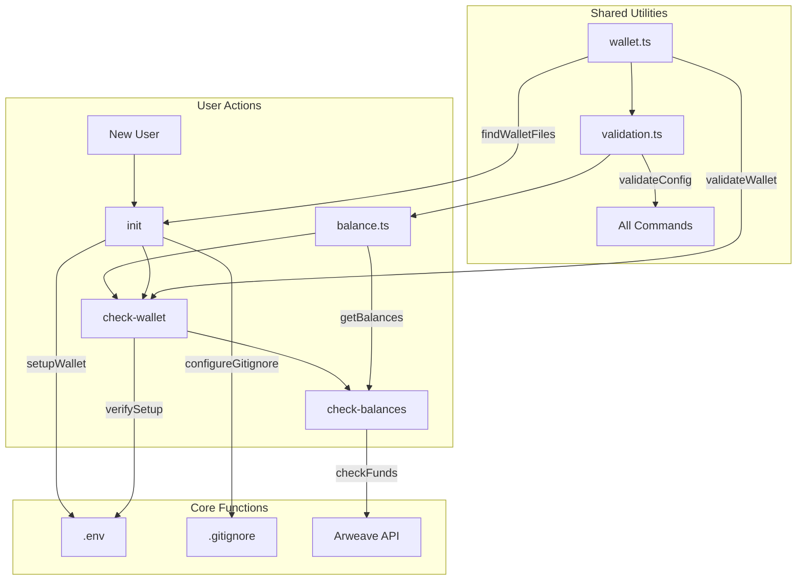

# Permalaunch Architecture

## Command Boundaries

### Command Flow Patterns
```
init:           Setup → Configure → Done
check-wallet:   Verify → Validate → Report
check-balance:  Calculate → Compare → Report
```

## Command Flow Diagram


## Project Structure
```
src/
├── commands/
│   ├── init.ts
│   └── checks/
│       ├── walletCheck.ts
│       └── balanceCheck.ts
├── utils/
│   ├── wallet.ts        # Wallet operations
│   │   ├── findWalletFiles()
│   │   ├── validateWallet()
│   │   └── encodeWallet()
│   │
│   ├── validation.ts    # Shared validation
│   │   ├── checkGitignore()
│   │   ├── validateEnv()
│   │   └── validateConfig()
│   │
│   └── balance.ts       # Balance operations
│       ├── getBalances()
│       ├── estimateCosts()
│       └── checkSufficiency()
└── types/
    └── wallet.ts        # Shared types
```

## Command Responsibilities

### Init Command (`init`)
- **Purpose**: First-time setup and configuration
- **Flow**: Setup → Configure → Done
- **Responsibilities**:
  - Detect wallet files
  - Configure environment
  - Set up security
  - Create/update .env
  - Update .gitignore

### Wallet Check Command (`check-wallet`)
- **Purpose**: Verify wallet configuration
- **Flow**: Verify → Validate → Report
- **Responsibilities**:
  - Verify init completion
  - Validate wallet format
  - Check environment setup
  - Provide setup guidance

### Balance Check Command (`check-balance`)
- **Purpose**: Verify financial readiness
- **Flow**: Calculate → Compare → Report
- **Responsibilities**:
  - Check WINC/AR balances
  - Estimate deployment costs
  - Verify sufficient funds
  - Provide funding guidance

## Shared Utilities

### Wallet Operations (`wallet.ts`)
- Wallet file detection
- Wallet validation
- Base64 encoding/decoding
- Wallet address management

### Validation (`validation.ts`)
- Environment validation
- Gitignore checks
- Configuration verification
- Security validation

### Balance Operations (`balance.ts`)
- Balance retrieval
- Cost estimation
- Sufficiency checking
- API interaction

## Security Considerations
- Secure file permissions
- Sensitive data handling
- Wallet file protection
- Environment variable security

## Testing Strategy
- Unit tests for utilities
- Integration tests for commands
- Security tests for sensitive operations
- Cross-platform compatibility tests
