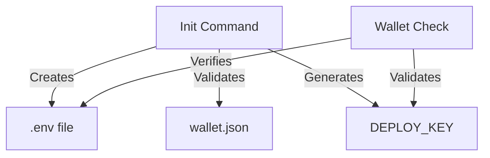

# Command Relationships

## Wallet Check and Init Commands

### Dependency Flow

### Responsibilities

#### Init Command
- Primary setup of wallet configuration
- Creation and validation of wallet.json
- Generation of DEPLOY_KEY
- Setting up .env file
- Initial security checks

#### Wallet Check Command
- Verification of init completion
- Validation of existing DEPLOY_KEY
- Wallet address verification
- No modifications to configuration

### Shared Utilities
Both commands use:
- validateInitStatus(): Checks initialization state
- getWalletAddress(): Validates wallet format
- Environment variable handling

### Best Practices
1. Always run init command first
2. Use wallet check for validation only
3. Re-run init if wallet check fails
4. Use balance check for fund-related operations

### Error Handling
- Init errors are handled by init command
- Wallet check reports but doesn't fix issues
- For fixes, users are directed back to init 